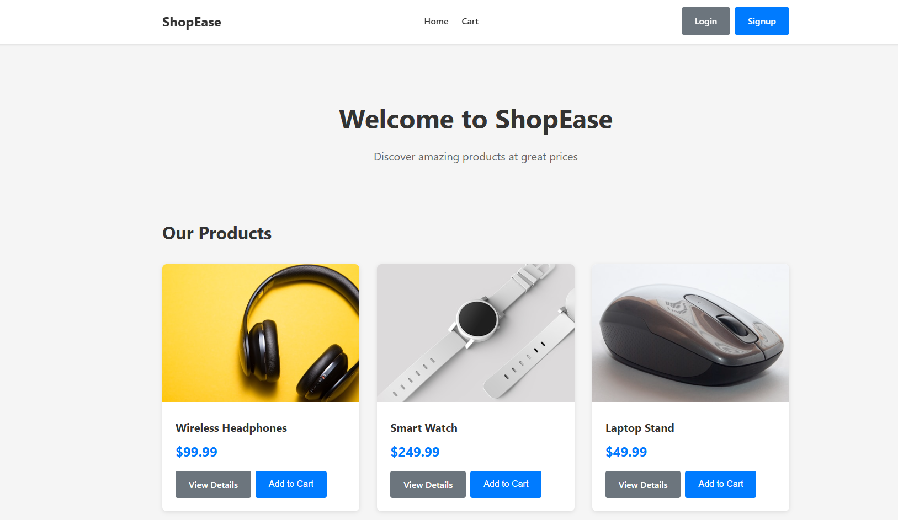
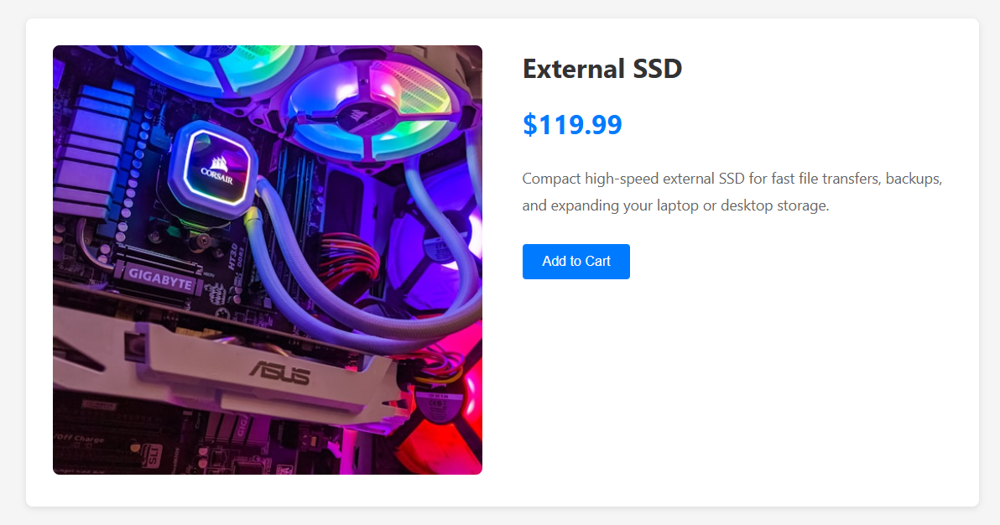
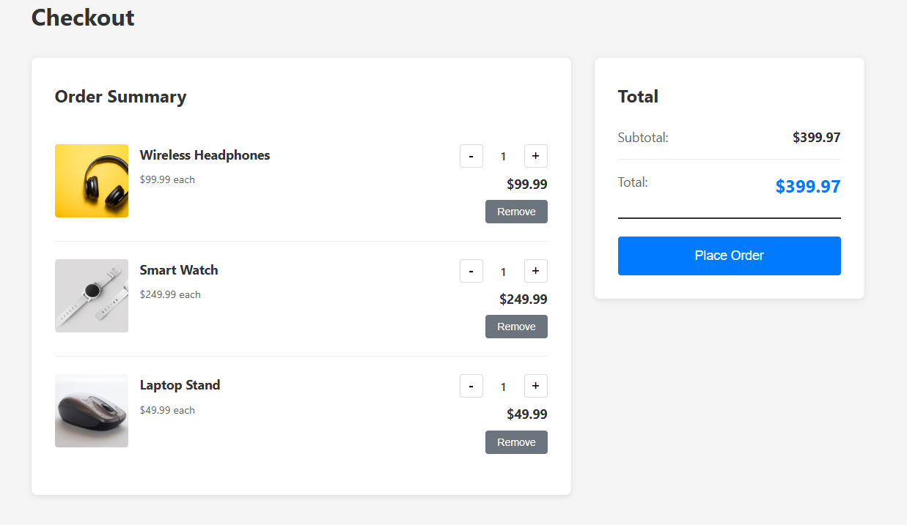

# ShopEase 🛍️

A simple e-commerce website I built with React while learning more about building and structuring real-world frontend applications.

I wanted to go beyond building individual components and put together a complete shopping flow — browsing products, viewing product details, managing a cart, signing in, and going through checkout.

## 📸 Preview



> More screenshots are included throughout the README below.

---

## What you can do

- Browse available products
- View individual product details
- Add products to your cart
- Update and manage cart items
- Sign in through the authentication flow
- Go through the checkout process
- Navigate between pages without full page reloads
- Use the application on different screen sizes

---

## 🖥️ Screenshots

### Home

The main page where users can browse the available products.


### Product Details

A closer look at an individual product and its information.



### Cart & Checkout

The shopping flow from adding products to the cart through checkout.



---

## 🛠️ Built With

- **React** — building the UI with reusable components
- **Vite** — development environment and build tooling
- **React Router** — handling navigation and dynamic product pages
- **React Context** — managing shared authentication and cart state
- **React Hook Form** — handling forms
- **JavaScript** — application logic
- **CSS** — styling and responsive layouts
- **Oxlint** — catching code-quality issues

---

## 🧩 How I Structured It

One thing I wanted to practice with this project was keeping the application organized instead of putting everything into a few large components.

The main parts of the app are separated into:

```text
src/
├── components/   # Reusable UI components
├── context/      # Shared application state
├── data/         # Product/application data
├── pages/        # Main application pages
├── App.jsx       # Routes and application setup
└── main.jsx      # Application entry point
```

For example, the cart and authentication state live in their own context files:

```text
context/
├── AuthContext.jsx
└── CartContext.jsx
```

This made it easier to access shared state from different parts of the application without passing the same props through multiple components.

---

## 🔄 Main User Flow

The main flow I was trying to build was:

```text
Browse Products
       ↓
Product Details
       ↓
Add to Cart
       ↓
Review Cart
       ↓
Checkout
```

I also added authentication as part of the overall application flow.

---

## 💡 What I Learned

This project helped me get more comfortable with React beyond just creating components.

Some of the biggest things I learned were:

### Managing shared state

I used React Context for things like the shopping cart and authentication. This gave me a better understanding of when state needs to be available across multiple components.

### Working with routes

I used React Router to create different pages and dynamic product routes. Working with routes helped me understand how separate pages in a frontend application can work together as one experience.

### Breaking UI into components

Instead of building everything inside a page component, I started identifying pieces that could be reused. Components such as the navigation and product cards can then be used across the application.

### Building a complete flow

Probably the most useful part of the project was connecting everything together.

Adding a product to a cart is simple by itself. Making that action update shared state, reflect in the UI, and carry through to checkout was a much better exercise in understanding how a frontend application actually works.

---

## 🚧 What I'd Like to Improve

This project is still a work in progress, and there are several things I'd like to add as I continue learning:

- [ ] Connect the frontend to a real backend/API
- [ ] Persist cart and user data
- [ ] Add product search and filtering
- [ ] Add categories
- [ ] Add order history
- [ ] Improve loading and error states
- [ ] Add automated tests
- [ ] Improve accessibility
- [ ] Deploy the application
- [ ] Eventually migrate the project to TypeScript

I think these would be good next steps for turning the project into something closer to a production application.

---

## 🚀 Running It Locally

If you'd like to run ShopEase locally:

### 1. Clone the repository

```bash
git clone https://github.com/JackyL1030/ShopEase.git
cd ShopEase
```

### 2. Install dependencies

```bash
npm install
```

### 3. Start the development server

```bash
npm run dev
```

Vite will provide a local URL in the terminal.

### Build for production

```bash
npm run build
```

### Run the linter

```bash
npm run lint
```

---

## 📚 Why I Built This

I built ShopEase as a way to practice the parts of frontend development that are easy to understand individually but become more interesting when you have to connect them together.

It started as a learning project, but I've been using it to get more comfortable with React, application structure, state management, routing, and building complete user experiences.

I'm still learning, so there are definitely things I'd do differently if I started the project again. That's also part of the reason I want to keep improving it.

---

## 🔗 Links

**Repository:**
https://github.com/JackyL1030/ShopEase

**Live Demo:**
https://shop-ease-pi-lilac.vercel.app/

---

## 👨‍💻 About

I'm a junior developer working on building stronger fundamentals through hands-on projects.

ShopEase is one of the projects I'm using to learn, experiment, and get better at writing frontend applications that are organized, reusable, and easy to build on.
